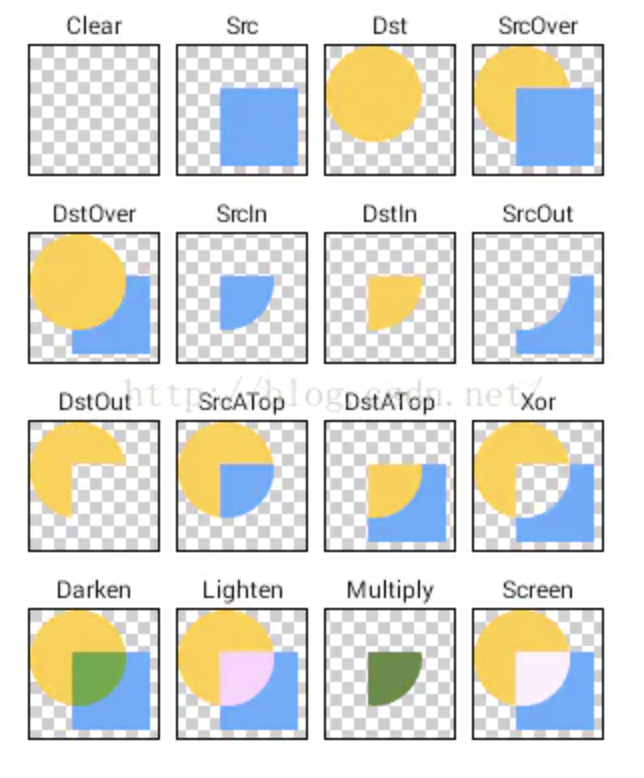

**ShaderMask** 可以给子组件加上渐变色

#### 渐变色文字

```dart
class GradientTitle extends StatelessWidget {
  final Gradient gradient = LinearGradient(
      begin: Alignment.topCenter,
      end: Alignment.bottomCenter,
      stops: [0.5, 1],
      colors: [Color(0xffffffff), Color(0xddffc7c7)]);
  @override
  Widget build(BuildContext context) {
    return ShaderMask(
      shaderCallback: (Rect bounds) {
        return gradient.createShader(bounds);
      },
      blendMode: BlendMode.srcATop,
      child: Text(
        "渐变色文字",
        textAlign: TextAlign.center,
        style: TextStyle(
          fontSize: 36.0.w,
          fontWeight: FontWeight.bold,
        ),
      ),
    );
  }
}
```

1. stops和颜色的个数是对应的

2. bendMode是混合模式，dst代表子组件，src代表shader(记不住的话，可改变代码确定对应关系)。将src与dst进行组合，但只组合src和dst重合部分，不重合部分显示dst



