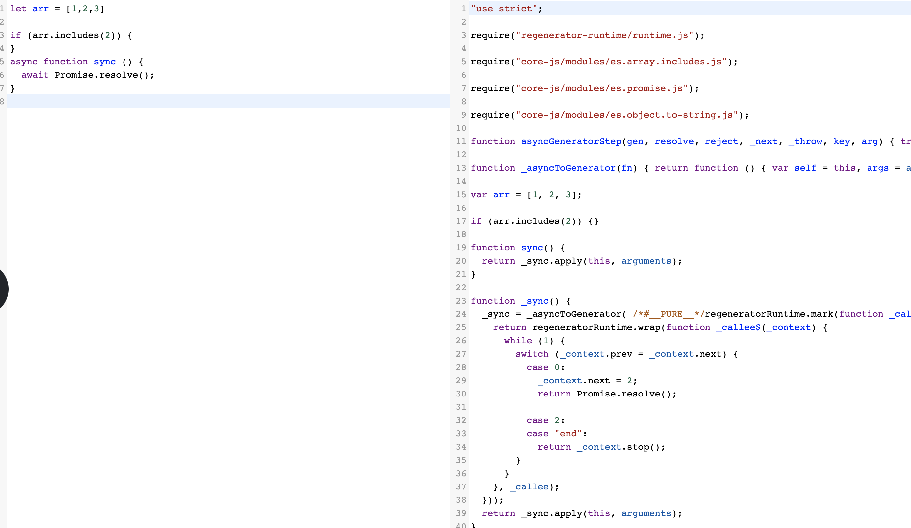

babel插件太多了，但是又不是经常需要配置这个，时间久了总是容易忘记啥插件干啥，记录一下。

### transform-runtime作用
babel转义的时候，对新的api的处理方式是引入pollyfill， 但是pollyfill会有一些重复的helper函数和需要额外的导入一个`regenerator-runtime/runtime.js`依赖， transform-runtime可以自动导入这个包和合并一些重复的helper函数。我们可以手动验证一下

首先在babel官网的[try it out](https://babeljs.io/repl)中写入一段es6代码，然后将目标设置为ie8以上，得到babelb的编译结果

```javascript
let arr = [1,2,3]

if (arr.includes(2)) {}

// 编译结果
"use strict";

var arr = [1, 2, 3];

if (arr.includes(2)) {}
```

可以看到babel默认转化了 `let` 但是没转化`includes`这个api，默认情况下，babel-presets只会编译新的语法，不编译新的api， 要处理新的api的话，需要用到pollify。


在侧栏preset的配置中选中buildins，然后设置为usages(和日常的`.babelrc`里的配置一样，只pollyfill用到的特性)，顺便加点新代码，可以看到新的输出。说明pollify生效了，但是会有几个问题。




1. _asyncToGenerator函数是私有的，那么多处使用会重复，造成不必要的开销。
2. require("regenerator-runtime/runtime.js"); 这个包是新的依赖。


然后我们可以使用transform-runtime来解决上面两个问题。加入@babel/plugin-transform-runtime。得到新的结果。


healper函数变成公用的了, 上面两个问题解决了。

> 最近现在babel升级了， corejs3配置有点问题，buildins和transform-runtime里的corejs3会冲突。下面记录下方案的链接。

[polyfill 还是 transform-runtime](https://segmentfault.com/a/1190000020237790)

# [corejs3 的更新](https://segmentfault.com/a/1190000020237817)

可以使用下面的配置。不污染全局空间。

```js
{
  "presets": [
    [
      "@babel/preset-env"
    ]
  ],
  "plugins": [
    ["@babel/plugin-transform-runtime", {
      "corejs": 3
    }]
  ]
}
```

