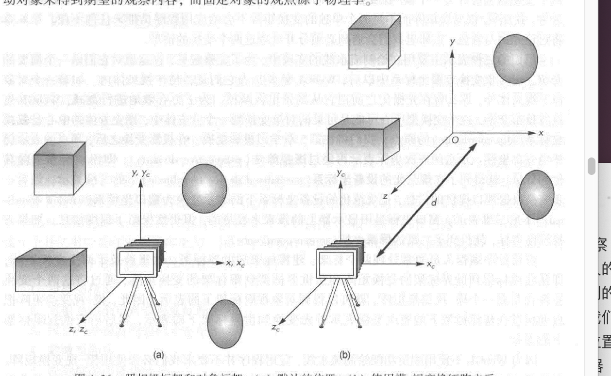
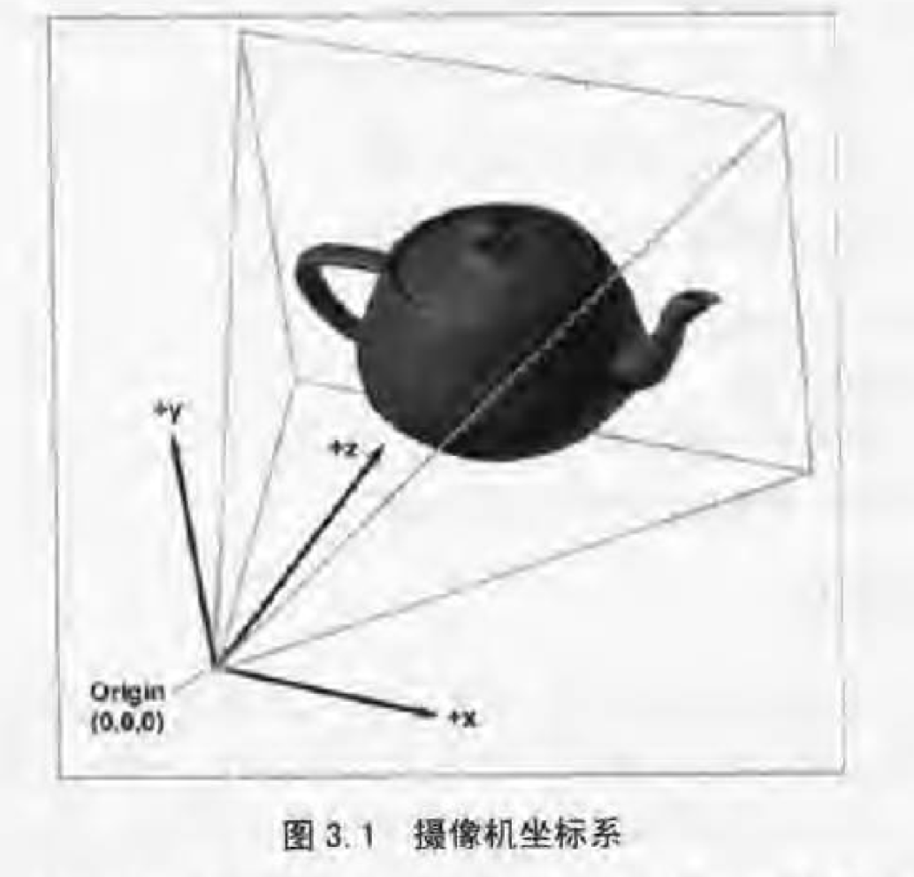
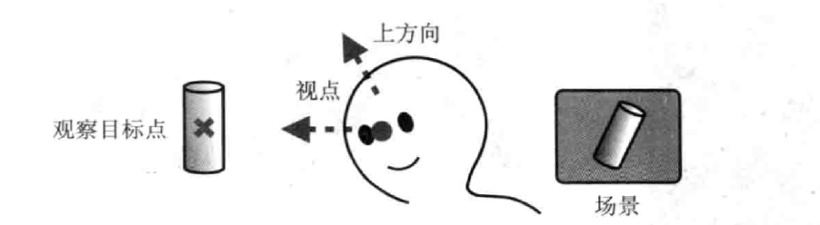
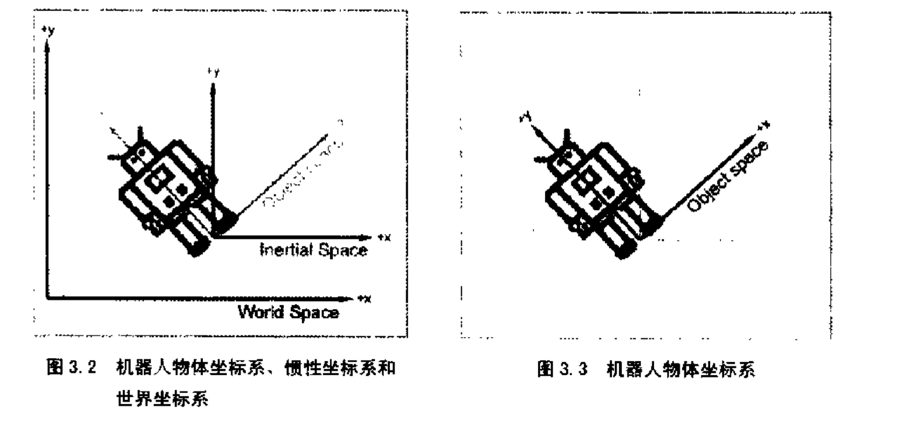
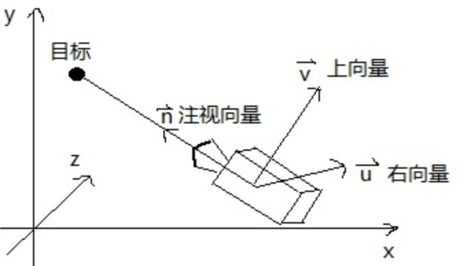

> 请使用typroa打开该笔记，并启用数学公式

### 模型矩阵，视图矩阵，投影矩阵的学习

在webgl里，要画出3d模型的话需要用到很多新的概念（对于没学习过图形学的人来说，比如我）。第一个比较重要的概念就是相机，《webgl编程指南》这边书里在开始讲3d的时候直接提供`lookAt`函数来实现相机功能，但是并没有讲的很详细，或许是我没有看到。由于不想不明不白的直接使用现成的函数，所以在网上搜罗资料整理了本文，总结下来方便以后学习。

要实现相机，首先得知道三个概念，**模型坐标系** ，**世界坐标系**，**摄像机坐标系**， 首先**模型矩阵**是比较简单的，是模型所在空间的坐标系, 通常在模型内部

**世界坐标系** 指的是模型在webgl的坐标，模型可以通过矩阵变换放入世界坐标系里。

个人主观上的理解，**模型坐标**就是描述模型的。比如立方体的四个点的位置，模型坐标系是随着模型的移动而移动，**世界坐标系**就是webgl坐标系，3d世界其他坐标系以该做坐标系作为参考，然后**摄像机坐标系**就是世界坐标系里选一个点，当作视点吧，这个点根据一些参数建立的坐标系，如图

主要有三个参数$$(eye_x, eye_y, eye_z),(at_x, at_y, at_z), (upx,upy,upz)$$ 分别是视点，观察目标点，和上方向，由观察目标点和视点可以连接成一条视线，我们把视点想想成人的眼睛，在眼睛和观察点的位置不变的情况下，我们还可以以视线为轴旋转，这样看到的东西也不一样，所以要上方向来确定这个，上方向是个向量。（打个比方，类似于我们看显示器，假如我们由坐着看显示器改为侧卧看显示器，这样显示器和眼睛的空间位置没变，但是人相对于显示器是旋转90度了，我们看到的东西就不一样了，虽然显示器的内容一样，但是画面对于我们来说，画面已经旋转了，上方向就是来确定这个的，相当于头的朝向）

#### 坐标系直接的转换

在模型坐标系和世界坐标系的转换中，为了方便，有人引入的惯性坐标系，惯性坐标系原点和模型坐标系原点相同，方向和世界坐标系保持水平。

由这两个特性就可以推出，模型坐标系到世界坐标系可以先经过旋转，然后通过平移来变换到世界坐标系，同样从世界坐标系转换到相机坐标系也是经过旋转，平移操作来转换

#### 视变换矩阵

（图来自百度图片）

webgl里我们观察物体由正面到观察侧面，这样有两种方式， 第一种，物体不动，相机转动，第二种就是相机不动，物体转动，我们采用第二种方式。

首先得有相机坐标系，根据`lookat`函数的参数我们可以构建一个相机坐标系（需要向量叉乘的知识， 两个向量叉乘，会得到垂直于两个向量的向量）

1、 n向量的话可以由视点和目标点得出$\vec{n} = (eye_x, eye_y, eye_z) - (at_x, at_y, at_z)$

2、根据上方向和n向量可以得到u向量$\vec{n} = \vec{up} \times \vec{n}$

3、同理 $\vec{v} = \vec{u} \times \vec{n}$

经过三个步骤就得到了相机的坐标系，将三个向量转为单位向量，方便使用。

$\vec{f} = \frac{\vec{n}}{|\vec{n}|}$

$\vec{s} = -1\frac{\vec{u}}{|\vec{u}|}$

$\vec{up} = \frac{\vec{v}}{|\vec{v}|}$

有了相机坐标系后，考虑相机坐标系怎么来的，可以看成是从和世界坐标系旋转平移来的，根据上面得到的相机坐标系归一后的向量，我们也能得到变换矩阵。

$\vec{相机} = \begin{bmatrix} s_x & s_y & s_z \\ up_x & up_y & up_z \\ f_x & f_y &f_z\end{bmatrix} \cdot [x,y,z]$

相机坐标系可以看成是世界坐标系旋转平移而来，旋转的矩阵其实就是我们求出来的相机坐标系的三个分量。平移就很简单了

$\begin{bmatrix} s_x & s_y & s_z & eye_x\\ up_x & up_y & up_z &eye_y\\ f_x & f_y &f_z & eye_z \\ 0 & 0& 0& 1\end{bmatrix} = \begin{bmatrix} R & T \\ 0 & 1\end{bmatrix}$

在webgl里是相机坐标系不动，旋转物体，那可以看做是世界坐标系做上面所述的相机坐标系运动的相反的运动，也就是上面那个四维矩阵的逆矩阵，应为旋转变换是正交变换，那个变换矩阵就是正交矩阵，逆矩阵可以直接转置得到, 平移直接相反方向平移就行

$\begin{bmatrix} s_x & up_x & f_x & -eye_x\\ s_x & up_y & f_y &-eye_y\\ s_z & up_z &f_z & -eye_z \\ 0 & 0& 0& 1\end{bmatrix}$

> 暂时写到这里吧，后面再回来看看，再改改，有些概念我不一定理解的正确，如果有人发现文中错误，麻烦帮我指出来，谢谢了

#### 参考链接

[OpenGL学习脚印: 视变换(view transformation)](https://blog.csdn.net/wangdingqiaoit/article/details/51570001)

[关于lookAt函数的理解](http://www.360doc.com/content/14/1028/10/19175681_420515511.shtml)

[矩阵求逆的几何意义是什么](https://www.zhihu.com/question/33258489)

《3d数学基础》

