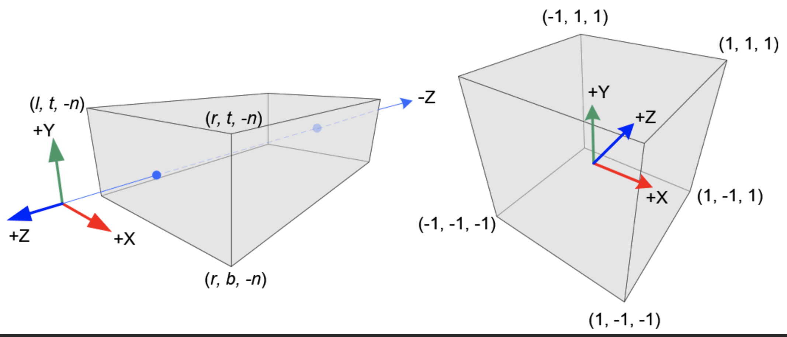

#### 正交投影

正交投影不涉及到近大远小这种问题，还是比较简单的，只有一个坐标的转换，在webgl里，我们观察物体，在使用正交投影的时候，基本上是将物体投影到一个规范化的立体空间里。如下图（百度图片找的）

假设webgl上显示的一点$(o_x,o_y,o_z)$， 投影到投影空间的点是$(p_x, p_y, p_z)$，

- t 近裁剪平面上面那条边
- b 近裁剪平面下面那条边
- l,r对应左右边

webgl的x轴坐标范围在[-1, 1]之间，投影空间里的点的范围是[l, r]，如果需要将物体上的点转化到这个范围里面，根据线性映射的话可以得出一个式子

$\frac{p_x - (-1)}{1 - (-1)} = \frac{o_x - l}{r - l}$ 可以变换得到 $p_x = \frac{2}{r-l}o_x - \frac{r + l}{r - l}$

同理 $p_y = \frac{2}{t-b}o_y - \frac{t + b}{t - b}$

$p_z = \frac{2}{f-n}o_z - \frac{f + n}{f - n}$

将三个式子写成矩阵的话

$p = \begin{bmatrix} \frac{2}{r-l} & 0 & 0 & -\frac{r + l}{r-l}\\0 & \frac{2}{t-b}  & 0 & -\frac{t + b}{t-b} \\ 0 & 0 &\frac{-2}{f-n} & -\frac{f + n}{f-n} \\ 0 & 0 &0& 1\end{bmatrix} \cdot [o_x, o_y, o_z, 1]$

这样我们就得到了正交投影变换矩阵