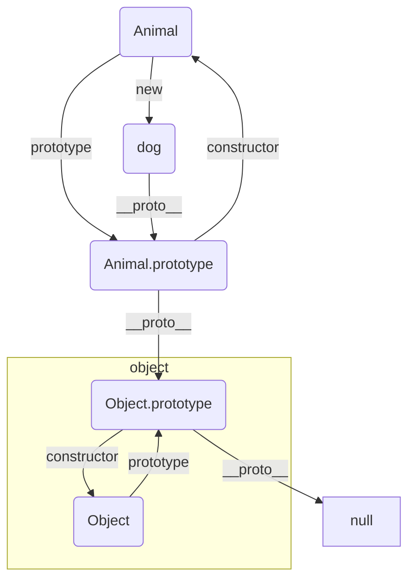
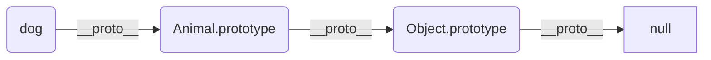
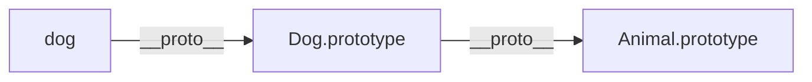

### javascript原型链
在es6出来之前，js里没有class关键字，实现继承只能手动操作原型链。es6种新增的class也是原型链的语法糖，所以要学好js是绕不开原型链的，最少面试也要问。

首先我们看下原型链是怎么使用的。
```javascript
function Animal() {
    this.weight = 20;
}
Animal.prototype.eat = function() {
    console.log('animal eat')
}

let dog = new Animal()
dog.eat() // 'animal eat'
```
在这段代码中，在Animal上没有定义eat，但是在实例上可以调用eat方法。因为在原型上定义了eat方法，在实例上调用eat的时候找不到，会自动在原型上查找，如果原型查不到，会查原型的原型。


上面的图表示原型和构造函数和实例之间的关系。构造函数创建实例，实例的__proto__指向原型，原型的constructor指向构造函数，原型通过__proto__指向原型的原型。最终会找到null

原型查找的路径


#### 特殊的原型

```javascript
Function.prototype.__proto__ === Object.prototype 

Function.__proto__ === Function.prototype
```

#### Object.create一个方便使用原型链的工具
`Object.create()`方法创建一个新对象，使用现有的对象来提供新创建的对象的__proto__。示例
```javascript
let dog2 = Object.create(dog)
dog2.eat() // animal eat
dog2.__proto__ === dog //true
dog2.__proto__.__proto__ === Animal.prototype //true
```
Object.create的实现方法
```javascript
function create(o) {
  function F() {}
  F.prototype = o;
  return new F();
}
```
利用原型链实现继承， 首先我们创建一个父类。然后创建一个子类，继承的话要处理两部分的问题，第一个属性继承的问题，第二方法继承。属性的话，可以直接调用父类构造函数，然后将this绑定到子类就行，通过call方法，将父类构造函数的this替换，在父类构造函数执行完之后，构造函数里提供的属性就会添加到子类this上。方法的话使用原型来继承, 只要让Child.prototype能找到Parent.prototype的方法就行，可以使用Object.create来实现，Child.prototype = Object.create(Parent.prototype),这样Child.prototype可以根据原型找到Parent.prototype, 最后修正构造函数就行
```javascript
function Animal() {
    this.weight = 20;
}
Animal.prototype.eat = function() {
    console.log('animal eat')
}
function Dog() {
    Animal.call(this)
}
Dog.prototype = Object.create(Animal.prototype)
Dog.prototype.constructor = Dog
const dog = new Dog()
```


#### es5实现的继承和es6继承的不同点
1. 在调用supper之前，es6的class是不能访问this， es5的可以， es5中子类this是先构造出来的，在调用父类，es6中是父类this先构造