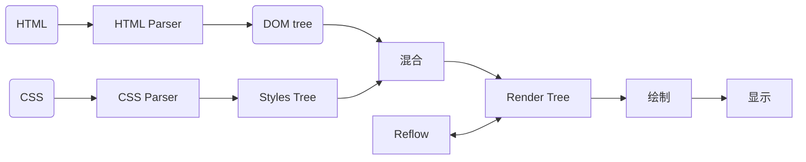

> ps: 使用typora总是丢内容, 换vscode试试水。

### 浏览器渲染的相关的知识

浏览器渲染有一些零碎的知识点，不常用经常忘记，写个文档记录下。

#### 浏览器渲染流程

渲染流程基本上就是上流程图，但是中间有几个注意的点。

1. 文档的解析是流式解析，也就是说接收到文本之后就开始解析，不需要等文档接收完。
2. javascript的加载是会阻塞文档的解析，遇到javascript脚本，会加载完并执行，可以用async和defer来改成异步的，defer不阻塞文档，会等文档解析完之后执行。async只有下载的时候是异步的，下载完立马执行。默认情况下载都会阻塞文档解析。
3. css解析不阻塞文本，但是css的解析会对脚本产生影响。javascript在css解析的时候，如果需要访问正在解析的styles的话，脚本会被禁用 。

#### 回流和重绘

##### 重绘
在元素改变了外观但是没改变尺寸的时候，比如背景颜色，文字颜色等，这个时候文档不需要重新计算布局，只需要将改变的元素重新绘制就行。

##### 回流(reflow)
dom在第一次绘制的时候和元素改变了尺寸或者布局的时候，如更换字体，修改元素大小等操作，由于尺寸的改变，浏览器需要重新计算元素的尺寸重新布局，然就再绘制,这过程叫回流。下面这些情况会导致回流。

1. 添加或删除可见的DOM元素
2. 元素的尺寸发生变化（包括外边距、内边框、边框大小等等）
3. 元素的位置发生变化
4. 页面一开始渲染的时候
5. 浏览器的窗口尺寸变化（因为回流是根据视口的大小来计算元素的位置和大小的）
6. 读取offset相关属性(offsetHeight, offsetHeight等)，浏览器会重新布局以得到精确的数据。

减少回流
1. 避免逐项更改样式。最好一次性更改style属性，或者将样式列表定义为class并一次性更改class属性。
2. 避免循环操作DOM。创建一个documentFragment或div，在它上面应用所有DOM操作，最后再把它添加到 window.document。
3. 避免多次读取offsetLeft等属性。无法避免则将它们缓存到变量。
4. 将复杂的元素绝对定位或固定定位，使它脱离文档流。否则回流代价十分高